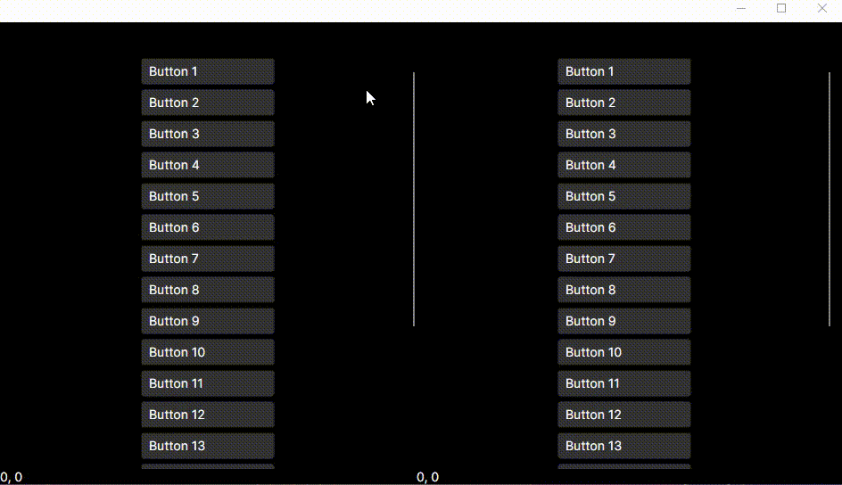

[](https://www.nuget.org/packages/Egolds.Avalonia.Xaml.Interactions.Animated)

# Avalonia.Xaml.Interactions.Animated

**Avalonia.Xaml.Interactions.Animated** is a simple library for Avalonia UI that introduces smooth animation support for vertical scrolling in the `ScrollViewer`. This library adds a smooth scroll effect to improve the user experience, especially for content with a lot of scrolling.



## Dependencies

This library depends on the `Avalonia.Xaml.Interactivity` package. Make sure you have it installed in your project:
- **NuGet Package**: [Avalonia.Xaml.Interactivity v11.2.0](https://www.nuget.org/packages/Avalonia.Xaml.Interactivity/11.2.0?_src=template)
- **GitHub Repository**: [AvaloniaUI/Avalonia.Xaml.Behaviors](https://github.com/wieslawsoltes/Avalonia.Xaml.Behaviors)

## Installation

You can install `Avalonia.Xaml.Interactions.Animated` via NuGet:

```bash
Install-Package Egolds.Avalonia.Xaml.Interactions.Animated
```

Or, if you prefer, download the `.dll` file directly from the [Releases section of this repository](https://github.com/Egolds/Avalonia.Xaml.Interactions.Animated/releases) and add it to your project references manually.

## Usage

To use `VerticalScrollViewerAnimatedBehavior` in your `.axaml` files, follow these steps:

### Step 1: Add the Namespace

Include the namespace in your `.axaml` file:

```xml
xmlns:ia="using:Avalonia.Xaml.Interactions.Animated"
```

### Step 2: Attach the Behavior
The animation effect is very easy to apply. Simply add `<ia:VerticalScrollViewerAnimatedBehavior/>` to the `Interaction.Behaviors` collection of your ScrollViewer:

```xml
<ScrollViewer Grid.Row="1" VerticalScrollBarVisibility="Auto" HorizontalScrollBarVisibility="Hidden">
  <Interaction.Behaviors>
    <ia:VerticalScrollViewerAnimatedBehavior/>
  </Interaction.Behaviors>
  
  <!-- Content for scrolling -->
</ScrollViewer>
```

### License
This project is licensed under the MIT License.
